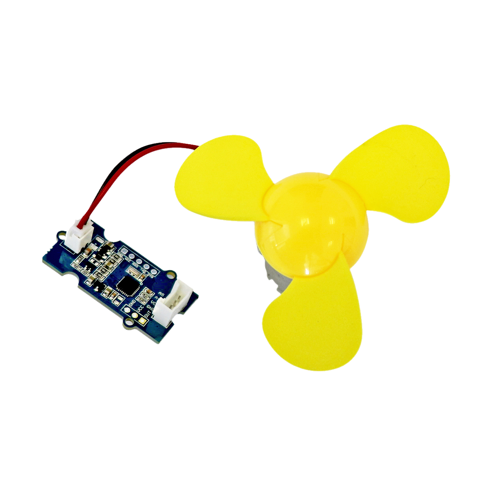

# Mini-Ventilator

## Beschreibung
Der Mini-Ventilator vereint einen Gleichstrommotor, einen kleinen Schaumstoff-Ventilator und die entsprechende Steuerung direkt in einem Paket. Die Steuerungseinheit übernimmt alle Funktionen und muss nicht zwingend an einen Mikrocontroller angeschlossen werden. Man kann beispielsweise mit einem an die Steuerung angeschlossenen Potentiometer direkt die Geschwindigkeit des Ventilators bestimmen. Alternativ kann der Ventilator ohne Steuerung über einen anderen Motortreiber an einen Mikrocontroller angeschlossen und bedient werden. Der Ventilator ist aus sehr weichem Material, sodass Verletzungen quasi unmöglich sind, selbst bei voller Drehzahl des Motors.

Alle weiteren Hintergrundinformationen sowie ein Beispielaufbau und alle notwendigen Programmbibliotheken sind auf dem offiziellen Wiki (bisher nur in englischer Sprache) von Seeed Studio zusammengefasst. Zusätzlich findet man über alle gängigen Suchmaschinen meist nur mit der Eingabe der genauen Komponentenbezeichnung entsprechende Projektbeispiele und Tutorials.

## Beispiele

!!!show-examples:./examples/

<!-- infolist -->

## Wichtige Links für die ersten Schritte:

- [Seeed Studio Wiki](http://wiki.seeedstudio.com/Grove-Mini_Fan/) [- Mini Ventilator](http://wiki.seeedstudio.com/Grove-Mini_Fan/)

## Weiterführende Hintergrundinformationen:

- [GPIO - Wikipedia Artikel](https://de.wikipedia.org/wiki/Allzweckeingabe/-ausgabe)
- [GitHub-Repository: Mini-Ventilator](https://github.com/MakeYourSchool/44-Mini-Ventilator)

